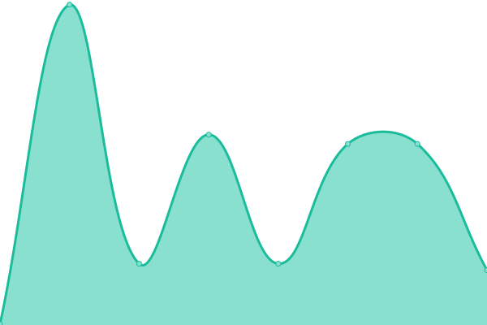
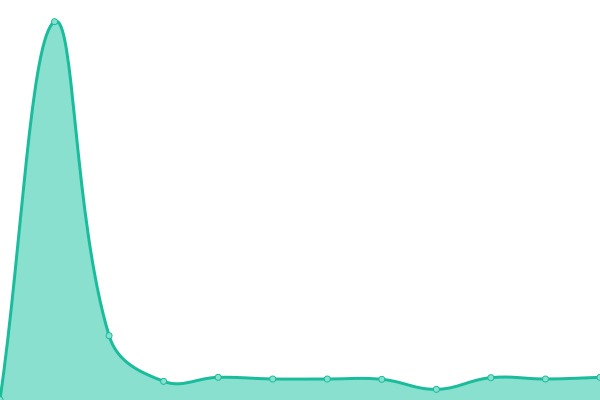
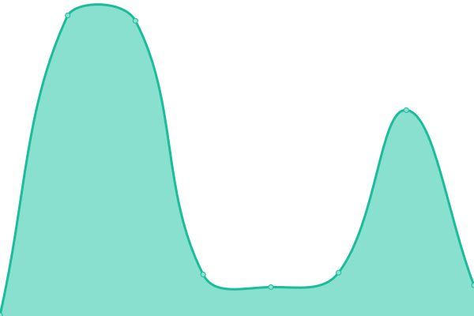

# [📈 Live Status](https://tannerhallman.github.io/coworks-uptime): <!--live status--> **🟩 All systems operational**

This repository contains the open-source uptime monitor and status page for [Tanner Hallman](tannerhallman.com), powered by [Upptime](https://github.com/upptime/upptime).

With [Upptime](https://upptime.js.org), you can get your own unlimited and free uptime monitor and status page, powered entirely by a GitHub repository. We use [Issues](https://github.com/tannerhallman/coworks-uptime/issues) as incident reports, [Actions](https://github.com/tannerhallman/coworks-uptime/actions) as uptime monitors, and [Pages](https://tannerhallman.github.io/coworks-uptime) for the status page.

<!--start: status pages-->
<!-- This summary is generated by Upptime (https://github.com/upptime/upptime) -->
<!-- Do not edit this manually, your changes will be overwritten -->
<!-- prettier-ignore -->
| URL | Status | History | Response Time | Uptime |
| --- | ------ | ------- | ------------- | ------ |
|  [Coworks Production Api](https://coworks-prod.herokuapp.com/api/v1/heartbeat/check_heartbeat) | 🟩 Up | [coworks-production-api.yml](https://github.com/tannerhallman/coworks-uptime/commits/HEAD/history/coworks-production-api.yml) | 

 136ms
     
 | 

<a href="https://tannerhallman.github.io/coworks-uptime/history/coworks-production-api">100.00%</a>
    

|  [Coworks Dev Api](https://coworks-dev.herokuapp.com/api/v1/heartbeat/check_heartbeat) | 🟩 Up | [coworks-dev-api.yml](https://github.com/tannerhallman/coworks-uptime/commits/HEAD/history/coworks-dev-api.yml) | 

 127ms
     
 | 

<a href="https://tannerhallman.github.io/coworks-uptime/history/coworks-dev-api">100.00%</a>
    

|  [Coworks Testing Api](https://coworks-testing.herokuapp.com/api/v1/heartbeat/check_heartbeat) | 🟩 Up | [coworks-testing-api.yml](https://github.com/tannerhallman/coworks-uptime/commits/HEAD/history/coworks-testing-api.yml) | 

 133ms
     
 | 

<a href="https://tannerhallman.github.io/coworks-uptime/history/coworks-testing-api">100.00%</a>
    

<!--end: status pages-->

[**Visit our status website →**](https://tannerhallman.github.io/coworks-uptime)

## 📄 License

- Powered by: [Upptime](https://github.com/upptime/upptime)
- Code: [MIT](./LICENSE) © [Tanner Hallman](tannerhallman.com)
- Data in the `./history` directory: [Open Database License](https://opendatacommons.org/licenses/odbl/1-0/)
